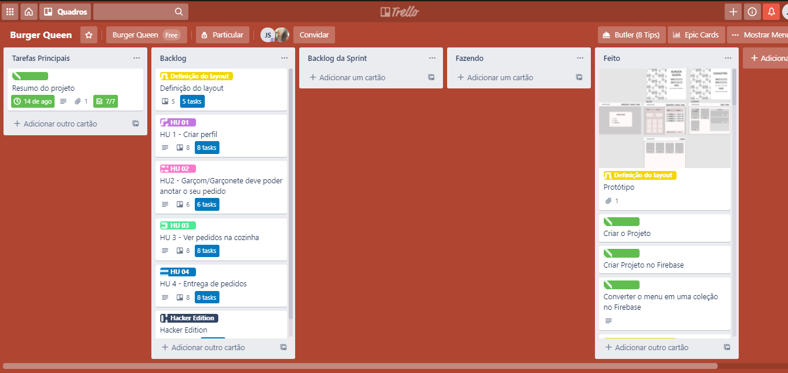
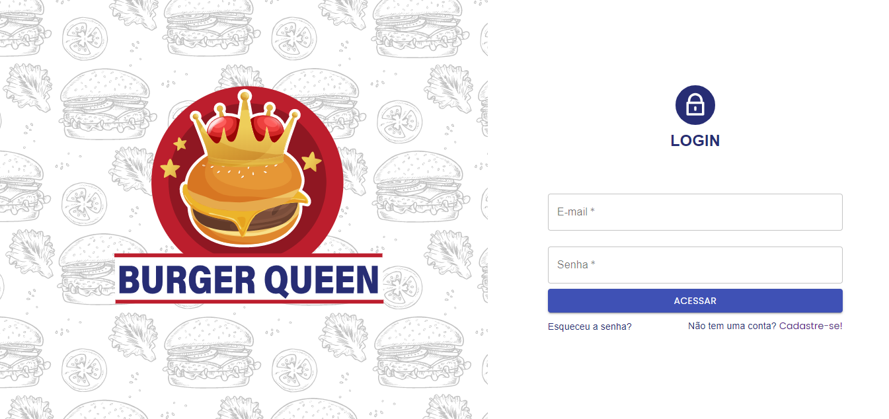
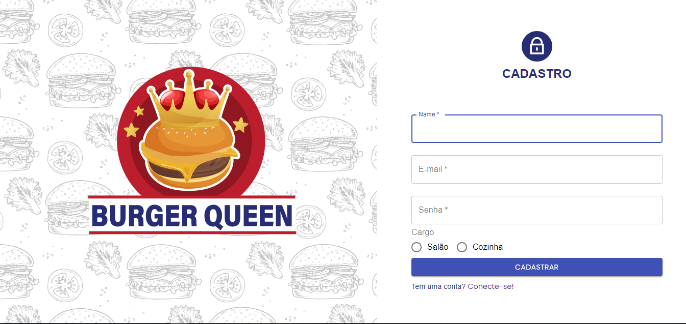

# Laboratória - 4ª Geração :two_hearts: 

****
## :hamburger: Projeto: Burger Queen
### Deploy: https://burguer-queen-a8030.web.app
***
## 1. Preâmbulo
Burger Queen é uma plataforma desenvolvida em React para um pequeno restaurante de hambúrgueres, que está crescendo e necessita de uma interface em que se possa realizar pedidos utilizando um tablet, e enviá-los para a cozinha para que sejam preparados de forma ordenada e eficiente.


Veja [aqui](https://trello.com/b/R7md1QCe/burger-queen)  o nosso planejamento.




## 2. Desenvolvimento 
- Protótipo de alta fidelidade 

Veja [aqui](https://www.figma.com/file/djjVXuYU2FygYzmoKMdlEF/Burger-Queen) o nosso protótipo.






****
## 3. Roadmap
- Testes
- Responsividade para dispositivo mobile

****

### :warning: Pré-Requisitos:

1. Node.js, NPM instalado e Firebase
****

### 🚀 Rodando o projeto localmente

****


1. Clone o projeto na sua máquina

```sh
git clone https://github.com/jucilene-barros-silva/burger-queen.git
```

2. Acesse a pasta do projeto
 
```sh
cd burger-queen
```

3. Instale todas as dependências do projeto

```sh
npm install
```

4. Antes de instalar o Firebase, certifique-se de criar uma conta e abrir um projeto novo ( visto que você não terá acesso ao nosso banco de dados):

5. Lembre-se de instalar o Firebase, utilizando o comando (este comando irá instalar o Firebase globalmente em sua máquina):

```sh
npm install -g firebase-tools
```

6. Faça login no Google. Execute este comando: (Esse comando conecta sua máquina local ao Firebase e concede acesso aos seus projetos.)

```sh
firebase login
```

7. Inicialize seu projeto utilizando o comando:

```sh
firebase init
```

8. Para abrir um servidor a fim de executar o projeto em seu navegador, é só digitar:

```sh
firebase serve
```

9. Após manipular o projeto e então realizar um deploy, utilize o seguinte comando:

```sh
firebase deploy
```

---------------------------------------------------
